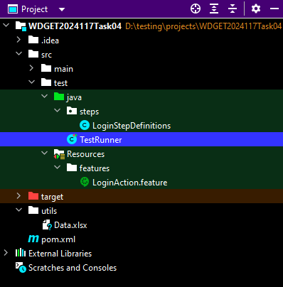
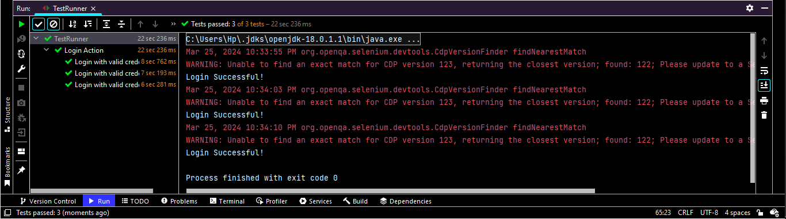

# Cucumber-Selenium Data-Driven Testing with Apache POI

This project demonstrates how to perform data-driven testing with Cucumber and Selenium WebDriver using Apache POI (Poor Obfuscation Implementation). The project allows you to read test data from an external Excel file and pass it to your Cucumber scenarios, enabling efficient and flexible testing.

## Overview

In this project, we integrate Apache POI with Cucumber and Selenium to facilitate data-driven testing. By leveraging Apache POI, we can read test data from an Excel file and use it to drive our Cucumber scenarios. This approach offers advantages such as centralized data management, reusability of test data, and support for complex data structures.

## Features

- **Apache POI Integration:** Utilize Apache POI to read test data from Excel files seamlessly.
- **Data-Driven Testing:** Perform data-driven testing by feeding external test data into Cucumber scenarios.
- **Flexible Data Sources:** Choose between using Cucumber's built-in data provider (e.g., `Examples` in feature files) or Apache POI for test data management.

## Usage

### Using Cucumber's Built-in Data Provider (Examples)

1. Define your Cucumber feature file with scenario outlines and examples.
2. Write step definitions to handle the provided test data.
3. Run your Cucumber tests as usual.

### Integrating with Apache POI

1. Create an Excel file containing your test data.
2. Modify your feature file to use scenario outlines without examples.
3. Update your step definitions to read test data from the Excel file using Apache POI.
4. Execute your Cucumber tests, and Apache POI will provide the test data.

## Project Structure

- `src/test/Resources/features`: Contains Gherkin feature files describing test scenarios.
- `src/test/java/steps`: Contains Java classes with step definitions for the scenarios defined in feature files.
- `src/test/java/TestRunner.java`: Contains the test runner class that configures and executes the Cucumber tests.
- `pom.xml`: Maven project configuration file specifying project dependencies and build settings.

## Test Results

After running the tests, you can view the test results in the console. Assertions and verifications are performed within the step definitions to validate the behavior of the application under test.

## Dependencies
- Cucumber: BDD framework for writing feature files and step definitions.
- Selenium WebDriver: Automation tool for interacting with web elements.
- JUnit: Unit testing framework for executing the Cucumber tests.
- Apache POI: 5.2.3 (or compatible version)

